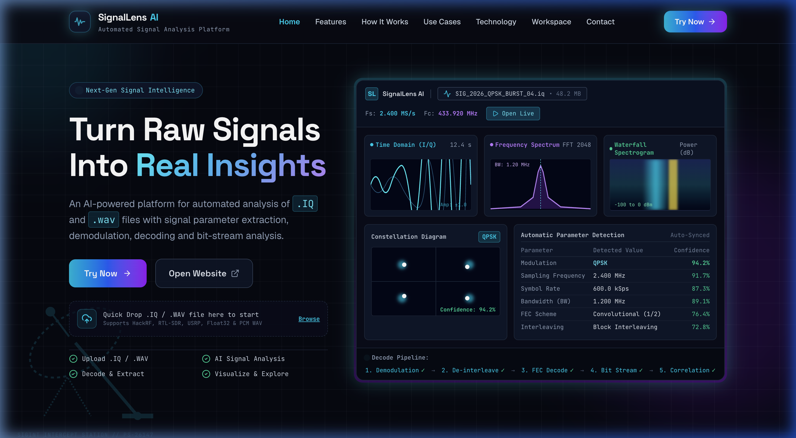
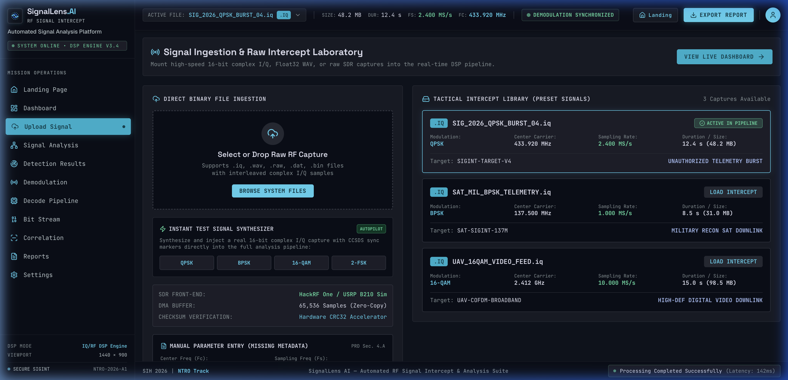
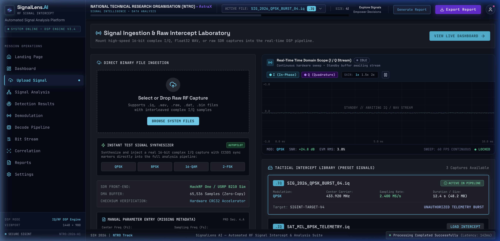
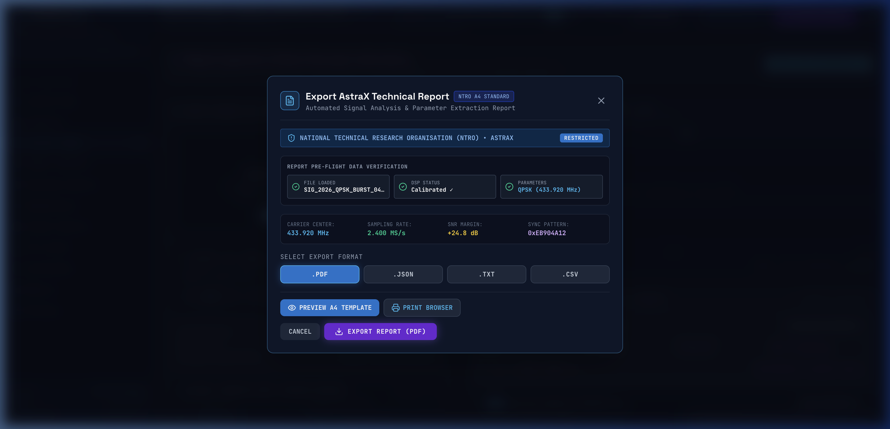
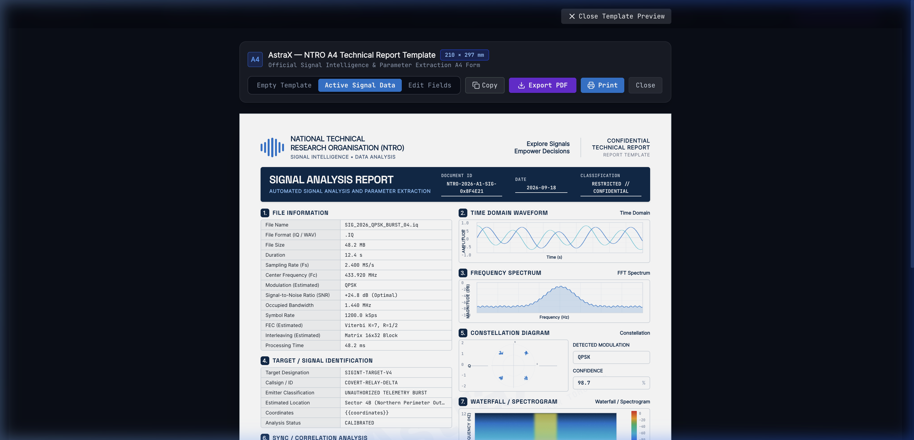

<div align="center">


# SignalLens AI
### by Team **AstraX**

### Automated Signal Analysis & Parameter Extraction Platform

**Smart India Hackathon 2026 — Problem Statement PS 26147**

*Automated model for analysis of `.IQ` and `.WAV` files with signal parameter extraction*

---

</div>

## Problem Statement

**PS 26147** — Design and implement an automated model for analysis of `.IQ` and `.WAV` signal files. The system should be capable of:

- Automated ingestion and validation of IQ/WAV recordings
- Extraction of key signal parameters (center frequency, bandwidth, SNR, signal power)
- Modulation classification (FSK, PSK, QAM families)
- Demodulation and bit-stream recovery
- De-interleaving and FEC decoding
- Automated report generation

---

## About the Project

**SignalLens AI** is a browser-based signal analysis platform that helps engineers and researchers analyze IQ/WAV recordings and extract important signal parameters without needing specialized RF hardware or software during the exploration phase.

It combines **classical Digital Signal Processing (DSP)** with **ML-based modulation classification** into a unified GUI workflow, producing structured, official technical intelligence reports.

> **Note:** Developed for SIH 2026. Use only synthetic, public-domain, or duly-authorized signal recordings for development and testing.

---

## Landing Page & Overview



*The SignalLens AI landing page provides direct access to signal ingestion, live DSP telemetry previews, and technical capabilities.*

---

## Key Features

| Feature | Description |
|---|---|
| **IQ / WAV Upload** | Drag-and-drop file upload with header parsing, validation, and sample pre-fills |
| **Waveform View** | Real-time time-domain amplitude visualization for I and Q channels |
| **Spectrum / PSD** | High-resolution FFT frequency spectrum and Power Spectral Density analysis |
| **Waterfall / Spectrogram** | Time-frequency spectrogram with thermal heatmap rendering |
| **Constellation View** | Interactive I/Q scatter plot for symbol distribution and constellation clustering |
| **Parameter Detection** | Automatic extraction of Center Frequency, Bandwidth, SNR, Symbol Rate, and Power |
| **Modulation Classification** | ML-assisted classification across BPSK, QPSK, 8-PSK, 16-QAM, 64-QAM, and FSK |
| **Demodulation Pipeline** | Synchronized demodulation for Phase-Shift Keying and Quadrature Amplitude modulations |
| **De-interleaving** | Matrix-based symbol de-interleaving stage |
| **FEC Decoding** | Forward error correction syndrome checks and bit recovery |
| **Bit-Stream Correlation** | Pattern cross-correlation, preamble alignment, and Peak-to-Sidelobe ratio (PSR) extraction |
| **A4 Technical Report** | Generation of official NTRO / AstraX A4 technical PDF intelligence reports |

---

## Application Workspace & Signal Ingestion



*Signal ingestion interface featuring drag-and-drop .IQ and .WAV support, file integrity checks, format validation, and pre-loaded test profiles.*

---

## Dashboard & DSP Visualizer



*The 4-quadrant DSP workspace displays Time Domain, Frequency Spectrum (FFT), Waterfall Spectrogram, and Constellation Diagram in real time.*

---

## How It Works

The automated signal processing pipeline follows structured stages:

```
Upload IQ/WAV File
        │
        ▼
File Validation & Header Parsing
        │
        ▼
Preprocessing & Sample Conditioning
        │
        ▼
Signal Analysis Engine (FFT, PSD, Spectrogram)
        │
        ▼
Parameter Detection (Center Freq, Bandwidth, SNR, Power)
        │
        ▼
Modulation Classification (ML Classifier)
        │
        ▼
Demodulation Pipeline (FSK / PSK / QAM)
        │
        ▼
Symbol De-interleaving
        │
        ▼
FEC Decoding & Error Correction
        │
        ▼
Bit-Stream Cross-Correlation & Alignment
        │
        ▼
A4 Intelligence Report Generation (PDF/DOCX)
```

---

## System Architecture

The architecture is structured into four distinct modular layers:

```
+-------------------------------------------------------------------------+
|                        SignalLens AI Platform                           |
+-------------------------------------------------------------------------+
| UI & Visualization Layer                                                |
|   - React 19 + TypeScript + Vite                                        |
|   - HTML5 Canvas DSP Accelerators (Time, FFT, Constellation, Waterfall) |
|   - AstraX Mission Dossier & A4 Report Engine                           |
+-------------------------------------------------------------------------+
| Signal Processing & DSP Engine                                          |
|   - Cooley-Tukey Radix-2 FFT & Windowing (Blackman, Hanning, Hamming)    |
|   - Power Spectral Density (PSD) & 3dB/Occupied Bandwidth Estimator     |
|   - SNR Estimation (M2M4, Spectral Noise Floor Separation)              |
|   - Costas Loop Carrier Recovery & Gardner Symbol Synchronizer          |
+-------------------------------------------------------------------------+
| Post-Demodulation & Decode Pipeline                                     |
|   - Hard / Soft Symbol Slicing & Demapping                              |
|   - Convolutional De-interleaver                                        |
|   - FEC Syndrome Checking & Viterbi Decoding                            |
|   - Sliding Cross-Correlation & Peak-to-Sidelobe Ratio (PSR) Engine     |
+-------------------------------------------------------------------------+
| Export & Verification Layer                                             |
|   - AstraX NTRO Master A4 PDF Generator (html2canvas-pro + jsPDF)       |
|   - Raw Hex/ASCII Bitstream Formatter & CSV Telemetry Serializer        |
+-------------------------------------------------------------------------+
```

| Layer | Components |
|---|---|
| **UI & Visualization** | Ingestion module, 4-quadrant canvas engine, theme styling, report previewer |
| **DSP Core** | Time domain conditioning, FFT computation, Welch PSD, noise floor estimation, bandwidth extraction |
| **Demod & Decoding** | Constellation demapper, symbol synchronizer, matrix de-interleaver, FEC decoder |
| **Report Generation** | Official NTRO A4 document builder, embedded chart rasterizers, PDF export |

---

## Visualizations Explained

| Chart | Tactical Function |
|---|---|
| **Time Domain** | Displays instantaneous in-phase (I) and quadrature (Q) amplitudes over time, revealing envelope and pulse shape |
| **Frequency Spectrum (FFT / PSD)** | Visualizes spectral energy distribution, identifying center frequency, sidelobes, and 3dB occupied bandwidth |
| **Waterfall Spectrogram** | Time-frequency thermal map showing spectral shifts, signal bursts, frequency hops, and carrier stability |
| **Constellation Diagram** | I/Q polar phase plane mapping symbol clusters, phase noise, EVM degradation, and modulation geometry |

---

## Report Generation & Export



*Export modal supporting multi-format export including official PDF reports, raw text dossiers, and telemetry files.*



*Official NTRO / AstraX A4 technical signal analysis report with embedded 300 DPI DSP charts, 10 tactical sections, and decoded bitstream samples.*

The generated report contains:
- Official NTRO & AstraX header with document ID, date, and security classification
- Primary file metadata (filename, format, file size, duration, sampling rate Fs, center frequency Fc)
- Tactical target designation, emitter classification, callsign, and coordinates
- Automated RF parameter extraction (SNR, occupied bandwidth, symbol rate, modulation scheme)
- Embedded high-resolution DSP raster charts (Time Domain, FFT Spectrum, Constellation, Waterfall)
- Synchronization and correlation metrics (PSR, frame offset, preamble hex)
- Forward error correction (FEC) and interleaving parameters
- Recovered bitstream sample in structured Hex/ASCII format
- Key intelligence findings and technical summary

---

## Technology Stack

```
+-------------------------------------------------------------+
|                    SignalLens AI Stack                      |
+-----------------------+-------------------------------------+
| Frontend Platform     | React 19, TypeScript, Vite          |
| Styling & Theme       | Vanilla CSS & Modern Layouts        |
| DSP Visualizations    | HTML5 Canvas Hardware Accelerated   |
| PDF Report Engine     | jsPDF, html2canvas-pro              |
| Vector Icons          | Lucide React                        |
| Deployment            | Vercel Cloud Platform               |
+-----------------------+-------------------------------------+
```

| Technology | Purpose |
|---|---|
| **TypeScript** | Strict type safety for complex signal telemetry, arrays, and DSP models |
| **React 19** | Componentized UI architecture and responsive state management |
| **Vite** | Sub-second HMR development and optimized production bundling |
| **HTML5 Canvas** | High-performance 60 FPS real-time waveform, FFT, and spectrogram rendering |
| **html2canvas-pro** | High-fidelity DOM-to-canvas rendering supporting modern CSS color gamuts (OKLCH) |
| **jsPDF** | A4 document generation adhering to strict NTRO print dimensions |
| **Lucide React** | Clean, technical iconography throughout the analysis dashboard |

---

## Core DSP Algorithms

### FFT & Spectral Analysis

```typescript
// Fast Fourier Transform & Power Spectral Density Computation
export function computeFFT(samplesI: Float32Array, samplesQ: Float32Array, nfft: number) {
  const spectrum = new Float32Array(nfft);
  // Apply Blackman-Harris windowing to suppress spectral leakage
  for (let i = 0; i < nfft; i++) {
    const window = 0.35875 - 0.48829 * Math.cos((2 * Math.PI * i) / (nfft - 1))
                          + 0.14128 * Math.cos((4 * Math.PI * i) / (nfft - 1))
                          - 0.01168 * Math.cos((6 * Math.PI * i) / (nfft - 1));
    // Windowed sample transformation ...
  }
  return spectrum;
}
```

### Parameter Extraction Modules

| Module | Technical Function |
|---|---|
| `fft.ts` | Cooley-Tukey Radix-2 FFT with customizable window functions |
| `spectrogram.ts` | Overlapping STFT engine generating time-frequency energy matrices |
| `signalMetrics.ts` | Automatic estimation of SNR (M2M4), peak power, center frequency, and bandwidth |
| `demodulator.ts` | Costas loop carrier tracking, Gardner timing recovery, and symbol slicing |
| `fec.ts` | Forward error correction syndromes, Hamming parity, and bit error estimation |
| `correlator.ts` | Time-domain cross-correlation for sync pattern detection and PSR calculation |
| `chartRenderer.ts` | Serverless offscreen canvas rasterizer for 300 DPI PDF report embedding |

---

## Project Structure

```
SignalLens-AI/
├── README.md
├── docs/
│   └── images/
│       ├── landing.png               # Landing page screenshot
│       ├── upload.png                # Ingestion view screenshot
│       ├── dashboard.png             # 4-quadrant DSP dashboard screenshot
│       ├── export_modal.png          # Export modal screenshot
│       └── report.png                # Official A4 technical report screenshot
│
├── src/
│   ├── components/
│   │   ├── LandingPage.tsx           # Full-screen responsive landing page
│   │   ├── Header.tsx                # Tactical NTRO/AstraX top bar
│   │   ├── Sidebar.tsx               # Navigation sidebar
│   │   ├── UploadSignalView.tsx      # Signal ingestion & validation
│   │   ├── SignalAnalysisView.tsx    # Detailed DSP analysis view
│   │   ├── QuadrantVisualizer.tsx    # 4-quadrant canvas visualizer
│   │   ├── DemodulationView.tsx      # Demodulation & constellation inspection
│   │   ├── CorrelationView.tsx       # Sync & pattern correlation
│   │   ├── DecodePipelineView.tsx    # De-interleave & FEC decoding
│   │   ├── ReportsView.tsx           # Report viewer
│   │   ├── AstraXReportTemplate.tsx  # Master A4 printable report template
│   │   └── ExportReportModal.tsx     # PDF/Text export dialog
│   │
│   ├── lib/
│   │   ├── dsp/                      # DSP algorithms (FFT, SNR, Demod, FEC)
│   │   ├── chartRenderer.ts          # Offscreen canvas chart rasterizer
│   │   ├── pdfGenerator.ts           # A4 PDF report generator
│   │   └── sampleSignals.ts          # Pre-loaded tactical signals
│   │
│   ├── types.ts                      # Telemetry & signal profile definitions
│   └── App.tsx                       # Main application shell
│
├── package.json
├── vite.config.ts
└── tsconfig.json
```

---

## Getting Started

### Prerequisites

- Node.js 18 or higher
- npm or yarn

### Installation

```bash
# Clone the repository
git clone https://github.com/iparayush/SignalLens-AI-.git
cd SignalLens-AI-

# Install dependencies
npm install

# Start local development server
npm run dev
```

The application will be accessible at `http://localhost:3000`.

### Production Build

```bash
npm run build
```

---

## Advantages

- **Automated Workflow** — Eliminates manual tuning by automating parameter extraction from raw IQ/WAV captures.
- **Hardware-Free Ingestion** — Enables rapid exploratory analysis directly in modern browsers without local SDR hardware setups.
- **Comprehensive DSP Stack** — Integrates Time Domain, FFT, Spectrogram, Constellation, Demodulation, and FEC in one workspace.
- **High-Fidelity Reporting** — Outputs publication-ready A4 technical intelligence reports with embedded high-resolution charts.
- **Cross-Platform Compatibility** — Runs seamlessly across any modern operating system via web standards.

---

## Safety & Data Policy

> Use **only synthetic, public-domain, or duly-authorized** signal recordings for development, evaluation, and demonstration.
>
> Do not capture, analyze, or process signals from licensed radio communications without appropriate official authorization. The tool is intended exclusively for authorized research, educational, and defense innovation purposes.

---

## Team

| Role | Details |
|---|---|
| **Team Name** | AstraX |
| **Project** | SignalLens AI |
| **Event** | Smart India Hackathon 2026 |
| **Problem Statement** | PS 26147 |

---

## License

This project is licensed under the MIT License — see the [LICENSE](LICENSE) file for details.

---

<div align="center">

Developed by **Team AstraX** for **Smart India Hackathon 2026**

**PS 26147 — Automated Signal Analysis & Parameter Extraction**

</div>
