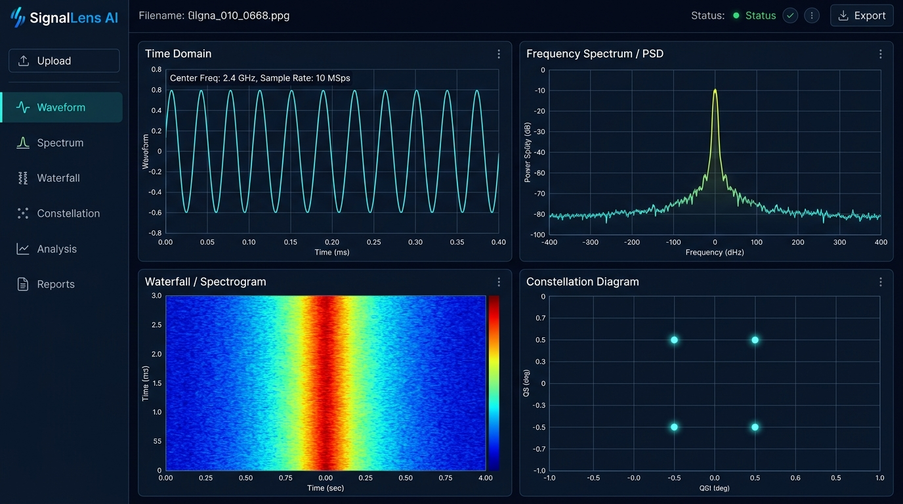
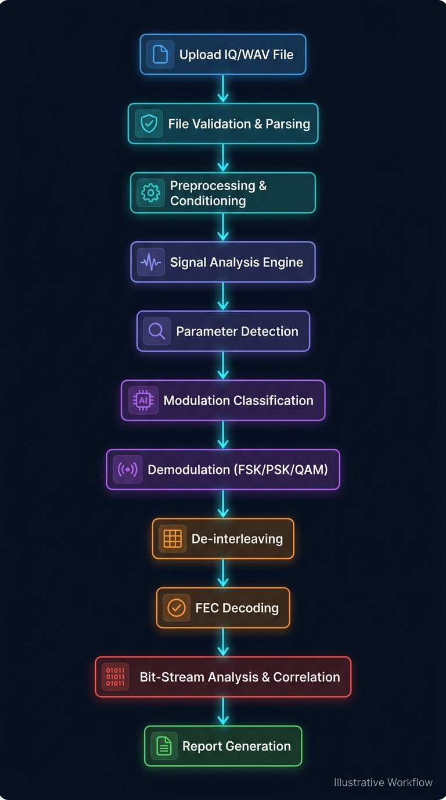
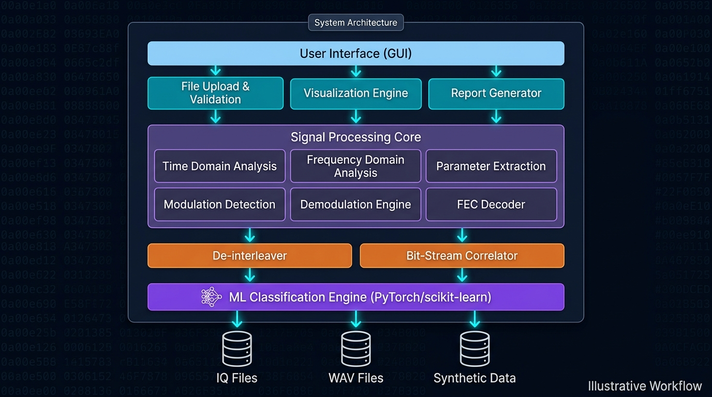
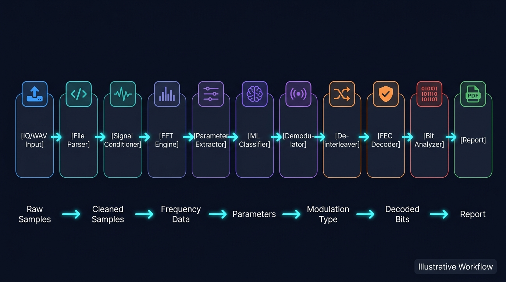
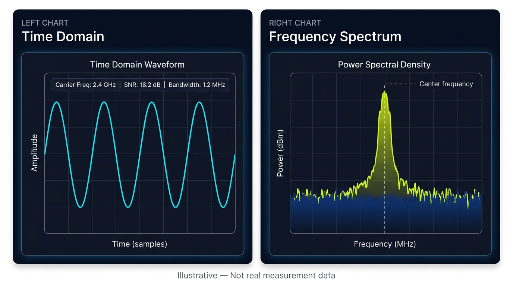
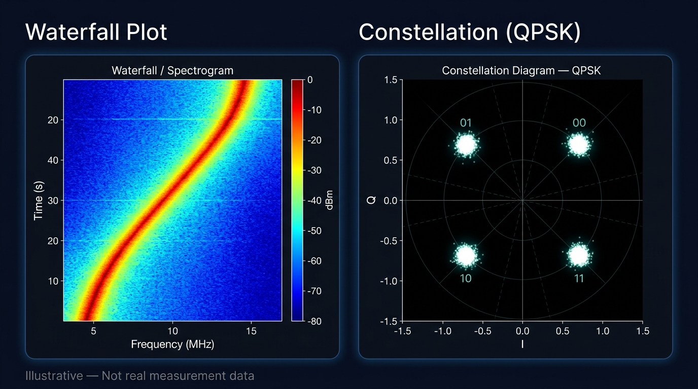
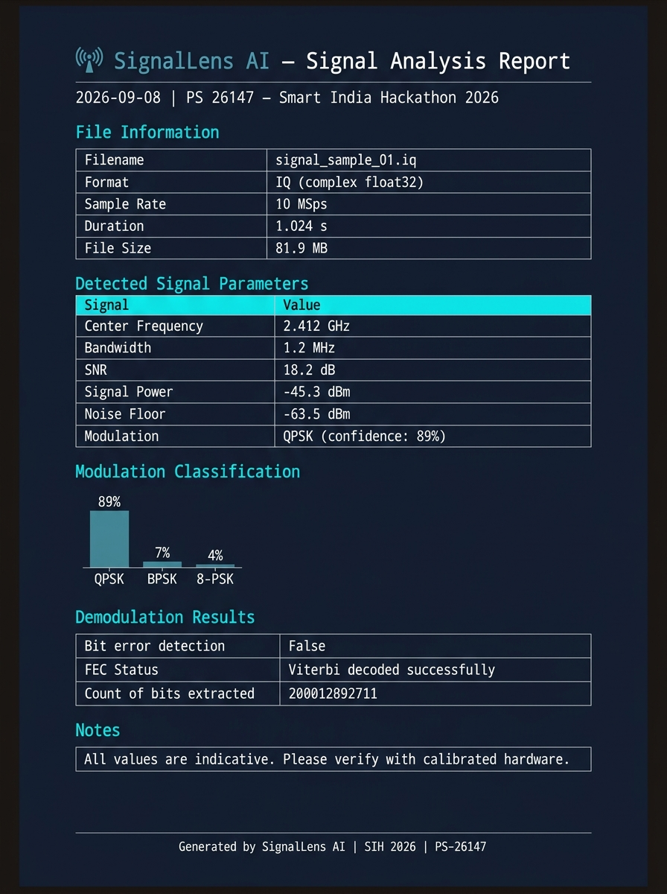

<div align="center">


# 📡 SignalLens AI  
### by Team **AstraX**

### Automated Signal Analysis & Parameter Extraction Platform

**Smart India Hackathon 2026 — Problem Statement PS 26147**

*Automated model for analysis of `.IQ` and `.WAV` files with signal parameter extraction*

---

</div>

## 📋 Problem Statement

**PS 26147** — Design and implement an automated model for analysis of `.IQ` and `.WAV` signal files. The system should be capable of:

- Automated ingestion and validation of IQ/WAV recordings
- Extraction of key signal parameters (center frequency, bandwidth, SNR, signal power)
- Modulation classification (FSK, PSK, QAM families)
- Demodulation and bit-stream recovery
- De-interleaving and FEC decoding
- Automated report generation

---

## 🧠 About the Project

**SignalLens AI** is a browser-based signal analysis platform that helps engineers and researchers analyze IQ/WAV recordings and extract important signal parameters — without needing specialized RF hardware or software during the exploration phase.

It combines **classical Digital Signal Processing (DSP)** with **ML-based modulation classification** into a unified GUI workflow, producing structured analysis reports at the end.

> **Note:** This is a prototype developed for SIH 2026. Use only synthetic, public-domain, or duly-authorized signal recordings for development and testing.

---

## 🎯 Key Features

| Feature | Description |
|---|---|
| 📁 **IQ / WAV Upload** | Drag-and-drop file upload with format validation |
| 📈 **Waveform View** | Time-domain amplitude visualization |
| 📊 **Spectrum / PSD** | FFT-based frequency and power spectral density analysis |
| 🌊 **Waterfall / Spectrogram** | Time-frequency spectrogram with heatmap coloring |
| 🎯 **Constellation View** | I/Q scatter plot for modulation visualization |
| 🔬 **Parameter Detection** | Auto-extraction of center freq, bandwidth, SNR, power |
| 🤖 **Modulation Classification** | ML-based classification (BPSK, QPSK, 8-PSK, FSK, QAM) |
| 📡 **Demodulation** | FSK / PSK / QAM demodulation pipeline |
| 🔀 **De-interleaving** | Symbol de-interleaving stage |
| ✅ **FEC Decoding** | Forward error correction (Viterbi/Hamming) |
| 🔗 **Bit-Stream Correlation** | Bit-stream cross-correlation analysis |
| 📄 **Report Generation** | Downloadable PDF analysis report |

---

## 🖥️ Dashboard



*The main dashboard shows Time Domain, Frequency Spectrum, Waterfall Spectrogram, and Constellation Diagram in a 4-quadrant layout.*

---

## ⚙️ How It Works

The signal processing pipeline follows these stages:

```
📂 Upload IQ/WAV File
        │
        ▼
🛡️  File Validation & Parsing
        │
        ▼
⚙️  Preprocessing & Conditioning
        │
        ▼
📊  Signal Analysis Engine (FFT, PSD, Spectrogram)
        │
        ▼
🔍  Parameter Detection (Freq, BW, SNR, Power)
        │
        ▼
🤖  Modulation Classification (ML)
        │
        ▼
📡  Demodulation (FSK / PSK / QAM)
        │
        ▼
🔀  De-interleaving
        │
        ▼
✅  FEC Decoding
        │
        ▼
🔗  Bit-Stream Analysis & Correlation
        │
        ▼
📄  Report Generation
```

### Workflow Diagram



---

## 🏗️ System Architecture



The system is organized into four layers:

| Layer | Components |
|---|---|
| **UI Layer** | File Upload, Visualization Engine, Report Generator |
| **Processing Core** | Time Domain, Frequency Domain, Parameter Extraction, Modulation Detection, Demodulation, FEC |
| **Post-processing** | De-interleaver, Bit-Stream Correlator |
| **ML Engine** | Modulation Classifier (PyTorch / scikit-learn) |

---

## 🔧 DSP Pipeline



The processing pipeline transforms data through these stages:

```
Raw Samples → Cleaned Samples → Frequency Data → Parameters → Modulation Type → Decoded Bits → Report
```

---

## 📊 Visualizations

### Waveform & Frequency Spectrum



> ⚠️ **Illustrative — Not real measurement data.** Charts shown are for demonstration purposes only.

| Chart | What it Shows |
|---|---|
| **Time Domain** | Signal amplitude over time, reveals waveform shape |
| **Frequency Spectrum / PSD** | Power distribution over frequency, reveals center frequency and bandwidth |

---

### Waterfall & Constellation



> ⚠️ **Illustrative — Not real measurement data.**

| Chart | What it Shows |
|---|---|
| **Waterfall Plot** | How signal frequency changes over time (good for spotting frequency-hopping or drift) |
| **Constellation Diagram** | I/Q symbol scatter — reveals modulation type from cluster pattern |

---

### Analysis Report



The generated report includes:
- File metadata
- Detected signal parameters
- Modulation classification with confidence
- Demodulation results
- FEC decoding status

---

## 🛠️ Technology Stack

### System Architecture Technologies

```
┌─────────────────────────────────────────────────────────────┐
│                    SignalLens AI System                     │
├──────────────────────┬──────────────────────────────────────┤
│   GUI Layer          │   PyQt / PySide6                     │
│   Visualization      │   Matplotlib / PyQtGraph             │
├──────────────────────┼──────────────────────────────────────┤
│   Signal Processing  │   Python + NumPy / SciPy             │
│   DSP Pipeline       │   GNU Radio                          │
├──────────────────────┼──────────────────────────────────────┤
│   AI / ML Engine     │   PyTorch / scikit-learn             │
├──────────────────────┼──────────────────────────────────────┤
│   High-Perf Core     │   C++ (libsigmf, custom DSP)        │
└──────────────────────┴──────────────────────────────────────┘
```

| Layer | Technology | Purpose |
|---|---|---|
| 🐍 **Signal Processing** | Python + NumPy / SciPy | FFT, PSD, filtering, correlation, FEC |
| 📡 **DSP Pipeline** | GNU Radio | Flowgraph-based signal routing and demodulation |
| 🤖 **AI Classification** | PyTorch | Deep learning-based modulation classifier |
| 📊 **ML Utilities** | scikit-learn | Feature extraction, preprocessing, evaluation |
| 🖥️ **GUI** | PyQt / PySide6 | Cross-platform desktop GUI |
| 📈 **Visualization** | Matplotlib / PyQtGraph | Waveform, spectrum, waterfall, constellation plots |
| ⚡ **High-Performance** | C++ | Real-time signal processing hot paths |

---

### 🐍 Python + NumPy / SciPy — Signal Processing & DSP

The core signal processing engine is built on Python's scientific stack:

```python
# Signal parameter extraction using NumPy/SciPy
import numpy as np
from scipy import signal, fft

# FFT-based spectrum analysis
frequencies = fft.fftfreq(N, d=1/sample_rate)
spectrum    = np.abs(fft.fft(iq_samples)) ** 2

# Welch PSD estimation
freq, psd = signal.welch(iq_samples, fs=sample_rate, nperseg=1024)

# Bandwidth estimation from PSD
center_freq = frequencies[np.argmax(spectrum)]
bandwidth   = estimate_3db_bandwidth(freq, psd)
```

**Modules:**

| Module | Responsibility |
|---|---|
| `numpy` | Array operations, FFT, math |
| `scipy.signal` | Filtering, PSD (Welch), correlation |
| `scipy.fft` | Fast Fourier Transform |
| `scipy.special` | Error functions, FEC helpers |

---

### 📡 GNU Radio — Signal Processing Pipeline

GNU Radio provides the flowgraph-based pipeline for real-time and file-based signal processing:

```
┌─────────────┐    ┌──────────────┐    ┌────────────────┐
│ File Source  │───►│  Low-Pass    │───►│  Demodulator   │
│ (.iq / .wav) │    │  Filter      │    │  (FM/AM/PSK)   │
└─────────────┘    └──────────────┘    └────────────────┘
                                                │
                          ┌─────────────────────▼──────────────────┐
                          │  Sink: File / GUI / Python Callback     │
                          └────────────────────────────────────────┘
```

**Key GNU Radio Blocks Used:**

| Block | Purpose |
|---|---|
| `blocks.file_source` | Read IQ/WAV from disk |
| `filter.low_pass_filter` | Anti-aliasing / channel filter |
| `analog.fm_demod_cf` | FM demodulation |
| `digital.psk_demod` | PSK demodulation |
| `digital.constellation_decoder_cb` | QAM/PSK symbol decisions |
| `fft.logpwrfft_c` | Real-time FFT for spectrum display |

---

### 🤖 PyTorch / scikit-learn — AI-Based Classification

The modulation classifier uses a CNN trained on spectrogram images:

```python
import torch
import torch.nn as nn

class ModulationClassifier(nn.Module):
    """
    CNN-based modulation classifier.
    Input:  Spectrogram image  (1 × 128 × 128)
    Output: Modulation probabilities (N classes)
    """
    def __init__(self, num_classes=8):
        super().__init__()
        self.features = nn.Sequential(
            nn.Conv2d(1, 32, kernel_size=3, padding=1),
            nn.ReLU(),
            nn.MaxPool2d(2),
            nn.Conv2d(32, 64, kernel_size=3, padding=1),
            nn.ReLU(),
            nn.MaxPool2d(2),
            nn.Conv2d(64, 128, kernel_size=3, padding=1),
            nn.ReLU(),
            nn.AdaptiveAvgPool2d((4, 4)),
        )
        self.classifier = nn.Sequential(
            nn.Linear(128 * 4 * 4, 256),
            nn.ReLU(),
            nn.Dropout(0.5),
            nn.Linear(256, num_classes),
        )

    def forward(self, x):
        x = self.features(x)
        x = x.view(x.size(0), -1)
        return self.classifier(x)

# Supported modulation types
MODULATIONS = ["BPSK", "QPSK", "8-PSK", "16-QAM",
               "64-QAM", "FSK-2", "FSK-4", "AM-DSB"]
```

**scikit-learn** is used for feature-based classification and preprocessing:

```python
from sklearn.preprocessing import StandardScaler
from sklearn.ensemble import RandomForestClassifier

# Feature vector: [SNR, bandwidth, spectral_kurtosis,
#                  cyclostationary_features, AM_index...]
classifier = RandomForestClassifier(n_estimators=100)
```

---

### 🖥️ PyQt / PySide6 — GUI Development

The desktop GUI is built with PySide6 (Qt6):

```python
from PySide6.QtWidgets import (
    QMainWindow, QWidget, QVBoxLayout,
    QHBoxLayout, QSplitter, QTabWidget
)
from PySide6.QtCore import Qt, QThread, Signal

class MainWindow(QMainWindow):
    def __init__(self):
        super().__init__()
        self.setWindowTitle("SignalLens AI — PS 26147")
        self._setup_ui()

    def _setup_ui(self):
        # 4-quadrant visualizer layout
        splitter = QSplitter(Qt.Horizontal)
        splitter.addWidget(self.waveform_panel)
        splitter.addWidget(self.spectrum_panel)
        # ...
```

---

### 📈 Matplotlib / PyQtGraph — Signal Visualization

**PyQtGraph** handles real-time plots (low-latency GPU-accelerated):

```python
import pyqtgraph as pg

# Waterfall spectrogram — real-time update
self.waterfall = pg.ImageItem()
self.waterfall.setColorMap(pg.colormap.get('CET-L9'))

# Constellation diagram
self.scatter = pg.ScatterPlotItem(size=3, pen=None,
                                   brush=pg.mkBrush(0, 200, 255, 180))
```

**Matplotlib** is used for static report charts:

```python
import matplotlib.pyplot as plt

fig, axes = plt.subplots(2, 2, figsize=(12, 8))
axes[0,0].plot(time, amplitude, color='#00e5ff')
axes[0,1].semilogy(freq, psd,   color='#c8f400')
axes[1,0].imshow(spectrogram, aspect='auto', cmap='jet')
axes[1,1].scatter(I, Q, s=1, alpha=0.3, color='cyan')
```

---

### ⚡ C++ — High-Performance Processing

Performance-critical DSP routines are implemented in C++ and exposed to Python via `pybind11`:

```cpp
// fft_engine.cpp — FFTW3-based high-performance FFT
#include <pybind11/pybind11.h>
#include <pybind11/numpy.h>
#include <fftw3.h>

namespace py = pybind11;

py::array_t<double> compute_psd(py::array_t<std::complex<double>> samples,
                                  int nfft, double sample_rate) {
    // FFTW3 plan for maximum performance
    fftw_complex *in  = fftw_alloc_complex(nfft);
    fftw_complex *out = fftw_alloc_complex(nfft);
    fftw_plan plan = fftw_plan_dft_1d(nfft, in, out,
                                       FFTW_FORWARD, FFTW_ESTIMATE);
    // ... compute PSD ...
    fftw_destroy_plan(plan);
    return result;
}

PYBIND11_MODULE(signal_engine, m) {
    m.def("compute_psd", &compute_psd, "FFTW3-based PSD computation");
}
```

**C++ Components:**

| Component | Library | Purpose |
|---|---|---|
| FFT Engine | FFTW3 | Ultra-fast FFT computation |
| FEC Decoder | libcorrect | Viterbi / Reed-Solomon decoding |
| Correlator | Custom SIMD | Cross-correlation with AVX2 intrinsics |
| File Parser | libsigmf | IQ file format parsing |

---

### Core DSP Modules

```
src/
├── dsp/
│   ├── fft.py              # FFT wrapper (NumPy + C++ backend)
│   ├── spectrogram.py      # Short-time FFT spectrogram
│   ├── signal_metrics.py   # SNR, power, bandwidth extraction
│   ├── signal_generator.py # Synthetic signal generation
│   ├── demodulator.py      # FSK / PSK / QAM demodulation
│   ├── deinterleaver.py    # Symbol de-interleaving
│   ├── fec.py              # Forward error correction
│   └── correlator.py       # Cross-correlation analysis
│
├── ml/
│   ├── modulation_classifier.py  # PyTorch CNN classifier
│   ├── feature_extractor.py      # Statistical feature extraction
│   └── models/                   # Pre-trained model weights
│
├── gui/
│   ├── main_window.py            # PySide6 main window
│   ├── waveform_panel.py         # Time domain widget
│   ├── spectrum_panel.py         # Frequency spectrum widget
│   ├── waterfall_panel.py        # Spectrogram widget
│   └── constellation_panel.py    # I/Q scatter widget
│
├── cpp/
│   ├── fft_engine.cpp            # FFTW3 high-perf FFT
│   ├── correlator.cpp            # SIMD correlator
│   ├── fec_decoder.cpp           # Viterbi decoder
│   └── CMakeLists.txt
│
└── pipeline.py                   # GNU Radio flowgraph
```

---

## 🔬 Research Focus

```
DSP (FFT, PSD, Spectrogram)
        ↓
Parameter Detection (Freq, BW, SNR)
        ↓
Modulation Classification (ML)
        ↓
Demodulation (FSK / PSK / QAM)
        ↓
FEC Decoding (Viterbi / Hamming)
        ↓
Bit-Stream Correlation
```

---

## 📁 Project Structure

```
SignalLens-AI/
│
├── README.md
│
├── docs/
│   ├── images/
│   │   ├── dashboard.jpg             # Main dashboard UI
│   │   ├── waveform_spectrum.jpg     # Time domain + PSD charts
│   │   ├── waterfall_constellation.jpg # Waterfall + Constellation
│   │   └── report.jpg                # Sample analysis report
│   │
│   └── diagrams/
│       ├── workflow.jpg              # Step-by-step workflow
│       ├── architecture.jpg          # System architecture
│       └── pipeline.jpg              # DSP processing pipeline
│
├── src/
│   ├── components/
│   │   ├── UploadSignalView.tsx
│   │   ├── SignalAnalysisView.tsx
│   │   ├── DemodulationView.tsx
│   │   ├── CorrelationView.tsx
│   │   ├── DecodePipelineView.tsx
│   │   ├── QuadrantVisualizer.tsx
│   │   ├── ReportsView.tsx
│   │   └── ExportReportModal.tsx
│   │
│   ├── lib/
│   │   ├── dsp/
│   │   │   ├── fft.ts
│   │   │   ├── spectrogram.ts
│   │   │   ├── signalMetrics.ts
│   │   │   ├── signalGenerator.ts
│   │   │   ├── demodulator.ts
│   │   │   ├── deinterleaver.ts
│   │   │   ├── fec.ts
│   │   │   └── correlator.ts
│   │   │
│   │   ├── ml/
│   │   │   └── modulationClassifier.ts
│   │   │
│   │   ├── fileParser.ts
│   │   ├── pdfGenerator.ts
│   │   └── pipeline.ts
│   │
│   ├── types.ts
│   └── App.tsx
│
├── examples/                         # Sample signal files (coming soon)
├── package.json
├── vite.config.ts
└── tsconfig.json
```

---

## 🚀 Getting Started

### Prerequisites

- Node.js 18+
- npm or yarn

### Installation

```bash
# Clone the repository
git clone https://github.com/iparayush/SignalLens-AI-.git
cd SignalLens-AI-

# Install dependencies
npm install

# Start development server
npm run dev
```

The app will be available at `http://localhost:5173`

### Build for Production

```bash
npm run build
```

---

## 🌟 Advantages

- ✅ **Reduces manual effort** — Automates the entire signal analysis workflow end-to-end
- ✅ **Unified platform** — From file upload to report generation in one tool
- ✅ **AI + DSP** — Combines classical signal processing with ML-based classification
- ✅ **Multi-stage pipeline** — Covers demodulation, de-interleaving, FEC, and correlation
- ✅ **Confidence-based output** — ML classifier provides probability scores per modulation type
- ✅ **Reproducible reports** — Generates structured PDF reports for documentation
- ✅ **Browser-based** — No local installation of SDR tools required for initial analysis

---

## 🔮 Future Scope

| Area | Planned Work |
|---|---|
| **Modulation Types** | Add AM, FM, OFDM, LoRa, Bluetooth modulation support |
| **FEC Schemes** | Turbo codes, LDPC, Reed-Solomon |
| **ML Models** | Deep learning classifiers (CNN on spectrogram images) |
| **Batch Processing** | Multi-file batch analysis mode |
| **Parameter Estimation** | Improved automated channel estimation |
| **Export Formats** | JSON, CSV, and XML export alongside PDF |
| **Hardware Integration** | Direct SDR hardware streaming support |

---

## ⚠️ Safety & Data Policy

> Use **only synthetic, public-domain, or duly-authorized** signal recordings for development and testing.
>
> Do **not** capture, analyze, or process signals from licensed radio communications without appropriate authorization. The tool is intended for use with test signals and authorized data only.

---

## 👥 Team

| | |
|---|---|
| **Team Name** | 🚀 AstraX |
| **Project** | SignalLens AI |
| **Event** | Smart India Hackathon 2026 |
| **Problem Statement** | PS 26147 |

---

## 📜 License

This project is licensed under the MIT License — see the [LICENSE](LICENSE) file for details.

---

<div align="center">

Made with ❤️ by **Team AstraX** for **Smart India Hackathon 2026**

**PS 26147 — Automated Signal Analysis & Parameter Extraction**

</div>
